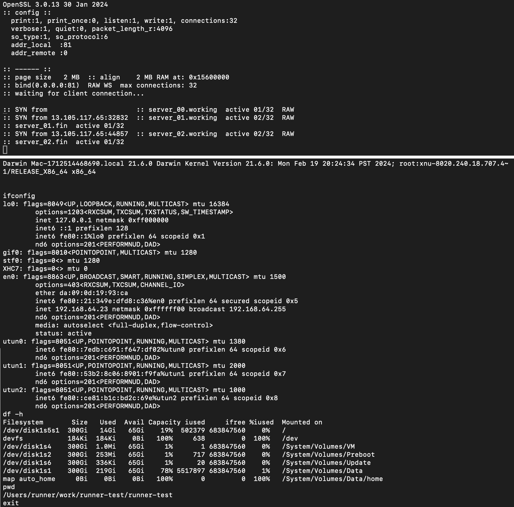

## reverse-shell macOS runner
GitHub hosted runners are an important tool for Continuous Integration.
Officially they are designed to compile and test applications.
As such they allow the user to customise the environment, install packages,
download and compile source code, run an automated list of commands.

What if one of these commands spawns a reverse-shell?
Well you get an interactive shell to run commands manually,
which might be helpful to inspect the build process,
fine-tune the testing environment and fix issues with the application.
This might also benefit users who lack access to a specific hardware platform.

Disclaimer:
This project is a Proof of Concept that hosted runners can run interactive commands.
Runners should only be used to test your projects.

[Using GitHub-hosted runners](https://docs.github.com/en/actions/using-github-hosted-runners/about-github-hosted-runners)  
[About GitHub-hosted runners](https://docs.github.com/en/actions/using-github-hosted-runners/about-github-hosted-runners/about-github-hosted-runners)  
[Customizing GitHub-hosted runners](https://docs.github.com/en/actions/using-github-hosted-runners/about-github-hosted-runners/customizing-github-hosted-runners)  
[Manually running a workflow](https://docs.github.com/en/actions/using-workflows/manually-running-a-workflow)  

### Workflow events
[workflow_dispatch](https://docs.github.com/en/actions/using-workflows/events-that-trigger-workflows#workflow_dispatch)  

## Configure
``` bash
TARGET='IP port'
```
Public address and port of the server that will receive the reverse-shell
connection from a runner.
- *netcat* `nc -lp 81`
- [g\_relay](https://httpstorm.com/download/g_relay/) which
forwards messages between two or more clients 

## Run
Actions, Workflows, reverse-shell, Run workflow  
[reverse-shell.yml](https://github.com/httpstorm/runner-test/actions/workflows/reverse-shell.yml)  

## OpenWRT build environment
Once connected to the runner, run
``` bash
./openwrt
```

Note:
The environment does not fully match the OpenWRT runners and may need to be optimised.
It was good enough to compile OpenWRT on a x64 host.

## Establishing a real ssh connection
It is possible to obtain a real ssh shell, but it's a bit tricky.
It works by making an outgoing ssh to your server with port forwarding
to expose ssh on the runner, where you can connect.

## Sensitive data
The reverse shell is using a simple unencrypted TCP connection over netcat.
Avoid sending sensitive data.

## Demo
[](https://youtu.be/7P2-c83tw_M)

Top terminal: [g\_relay](https://httpstorm.com/download/g_relay/), bottom terminal: *netcat* client


